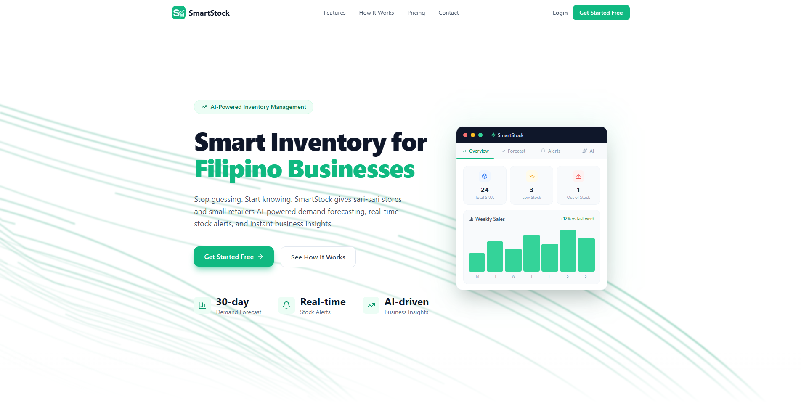
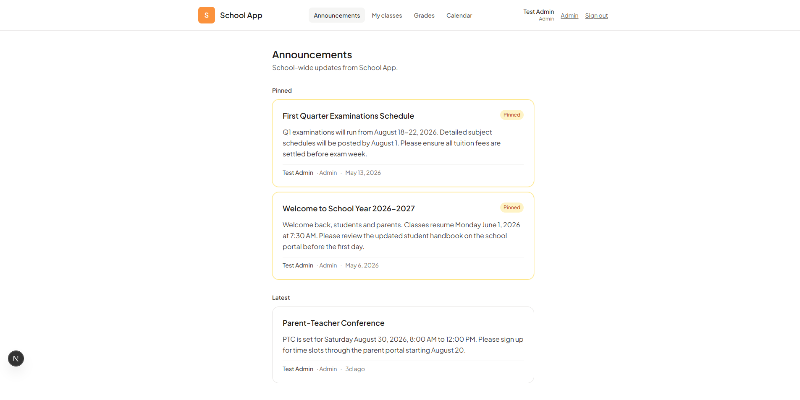

<!-- _class: cover no-page -->

  
ORAGON · BUSINESS PROFILE · 2026

  <h1>We build what actually ships.</h1>
  

    Custom AI tools and automated workflows for Filipino businesses.
  

  

    AI Automation
    Custom Software
    Philippines
  

---

<!-- _class: center -->

Who we are

<h2 style="max-width: 900px;">An AI automation agency built for Filipino businesses.</h2>

  

    
A

    
AI-native

    
Built with AI in the loop from the first commit.

  

  

    
P

    
PH-first

    
PHP pricing, GCash + Maya + cards, Filipino-SMB UX.

  

  

    
F

    
Founder-led

    
No agency handoffs. Same person scopes and ships.

  

---

What we've shipped

<h2>Three live products.</h2>

  

    
    
SmartStock

    
AI inventory SaaS for Philippine micro-retail.

    
smartstockapp.online

  

  

    
    
School App

    
Multi-tenant school portal for parents, faculty, admins.

    
oragon-schools-app.vercel.app

  

  

    
Live demo

    
Oragon Bookings

    
Appointment + reminder automation for service businesses.

    
book.oragon.com.ph

  

---

Product · SmartStock

<h2>AI inventory for micro-retail.</h2>

  
  

    <ul class="bullet-list">
      <li>Live PayMongo billing — card auto-renew + GCash and Maya monthly</li>
      <li>AI demand forecasting using Gemini and Prophet, 14-day history minimum</li>
      <li>Auto-downgrade for expired e-wallet users via Cloud Scheduler</li>
      <li>Multi-tenant on Cloud Run, every query scoped to user_id</li>
    </ul>
    

      Next.js 14
      FastAPI
      Neon
      Gemini
    

  

  Live since 2026
  smartstockapp.online

---

Product · School App

<h2>Multi-tenant school portal.</h2>

  
  

    <ul class="bullet-list">
      <li>School-wide and per-class announcements with read receipts</li>
      <li>Grade entry plus bulk xlsx upload, parent-facing report views</li>
      <li>Calendar with ICS subscribe — one-tap Google Calendar sync</li>
      <li>Magic-link auth for parents and students, password for admin and faculty</li>
    </ul>
    

      Next.js 16
      Supabase
      Tailwind v4
      Resend
    

  

  Live since 2026
  oragon-schools-app.vercel.app

---

Product · Oragon Bookings

<h2>Booking automation for service businesses.</h2>

  
Live demo

  

    <ul class="bullet-list">
      <li>Variable-time bookings with multi-booking-per-slot capacity</li>
      <li>Admin dashboard with reversible booking status</li>
      <li>Built for salons, clinics, restaurants, and cafés</li>
      <li>Branded per-tenant page via host-header routing</li>
    </ul>
    

      Next.js 15
      Supabase
      Tailwind
    

  

  Live since 2026
  book.oragon.com.ph

---

How we work

<h2>Custom builds, not subscriptions.</h2>

  

    
Step one

    
Free discovery call

    
30 minutes. We find the highest-leverage thing software can fix.

  

  

    
Step two

    
Scoped SOW

    
Fixed price, fixed timeline, plain language. No per-seat surprises.

  

  

    
Step three

    
Ship in weeks

    
2 to 6 weeks typical. Code, deployment, training, runbook.

  

---

What we can build

<h2>If you can name it, we can probably build it.</h2>

  

    
F

    
Restaurants and cafés

    <ul class="bullet-list">
      <li>Online booking</li>
      <li>No-show fees</li>
      <li>Branded ordering</li>
    </ul>
  

  

    
S

    
Salons and clinics

    <ul class="bullet-list">
      <li>Appointments</li>
      <li>Auto reminders</li>
      <li>Deposit collection</li>
    </ul>
  

  

    
R

    
Retail and sari-sari

    <ul class="bullet-list">
      <li>AI forecasting</li>
      <li>Low-stock alerts</li>
      <li>Barcode labels</li>
    </ul>
  

  

    
E

    
Schools

    <ul class="bullet-list">
      <li>Announcements</li>
      <li>Grade portals</li>
      <li>Parent calendar</li>
    </ul>
  

---

Process

<h2>Five steps. First call to live system.</h2>

  

    
01

    
Discovery

    
30 min, free

  

  

    
02

    
Scope

    
Fixed price + timeline

  

  

    
03

    
Build

    
2 to 6 weeks typical

  

  

    
04

    
Handoff

    
Training + runbook

  

  

    
05

    
Support

    
Optional retainer

  

---

Pricing

<h2>Per-project. Not per-seat.</h2>

  

    
Fixed project

    
One-time scope. One-time price. Shipped.

  

  

    
Project + retainer

    
Build, then ongoing monthly support and new features.

  

  

    
Discovery is free

    
30 minutes, no pitch deck attached.

  

  PHP, not USD. The real number lands in your SOW.

---

<!-- _class: center -->

Let's build something

<h1 style="text-align: center; max-width: 1000px; margin: 0 auto;">Ready to talk?</h1>

  Pick a time. 30 minutes. No prep needed. We'll figure out the right fit on the call.

  
Book a discovery call

  

    oragon.com.ph/clients
  

  

    support@oragon.com.ph
  

